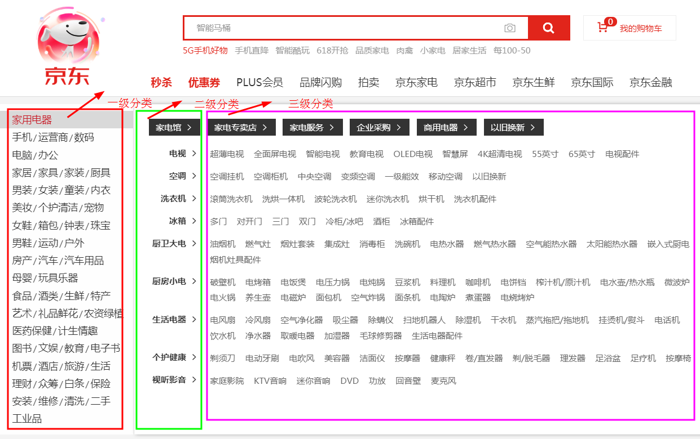

#### 1.需求

- 目标：明确要抓取哪些信息

##### 1.1抓取首页的分类信息

- 抓取数据：各级分类的名称和 URL

  

##### 1.2 抓取商品信息

- 抓取：商品名称，商品价格，商品评论数，商品店铺，商品促销，商品选项，商品图片的URL

  


#### 2.开发环境

- 平台：Windows 也可以运行在Mac 和Linux
- 开发语言：Python
- 开发工具：Pycharm
- 技术选择：
  - 由于全网爬虫，抓取页面非常多，为了提高抓的速度，选择使用scrapy框架+scrapy_redis分布式组件
  - 由于京东全网的数据量达到了亿级，存储又是结构化数据，数据库选择使用MongoDB


####  3.京东全网爬虫的实现步骤

> 我们采用广度优先策略，把分类和商品信息分开来做
>
> 好处：可以提高程序的稳定性

##### 	3.1 总体设计


##### 	3.2 实现步骤

> 1.创建爬虫项目
>
> 2.根据需求，定义数据模型
>
> 3.实现分类爬虫
>
> 4.保存分类信息
>
> 5.实现商品爬虫
>
> 6.保存商品信息
>
> 7.实现随机User-Agent和代理IP下载器中间件，解决IP反爬

##### 	3.3创建爬虫项目

- ```scrapy startproject mall_spider```


#### 4. 明确要抓取的数据（定义数据模型）

> 爬虫数据模型，我们只能根据需求，定义一个大概，随着对项目的实现可能会对数据模型作相应的修改

##### 	4.1 类别数据模型

- 类别数据模型类：用于存储类别信息（Category）- 字段：
  - `b_category_name`：大类别名称
  - `b_category_url`：大类别URL
  - `m_category_name`：中分类名称
  - `m_category_url`：中分类URL
  - `s_category_name`：小分类名称
  - `s_category_url`：小分类URL
- 代码：

```python
class Category(scrapy.Item):
    """商品类别"""
    #大分类名称
    b_category_name = scrapy.Field()
    #大分类URL
    b_category_url = scrapy.Field()
    #中分类名称
    m_category_name = scrapy.Field()
    #中分类URL
    m_category_url = scrapy.Field()
    #小分类名称
    s_category_name = scrapy.Field()
    #小分类URL
    s_category_url = scrapy.Field()

```

##### 4.2商品数据模型

- 商品数据模型类：用于存储商品信息（Product）
- 字段：
  - `product_category`：商品类别
  - `product_category_id`：商品类别ID
  - `product_sku_id`：商品ID
  - `product_name`：商品名称
  - `product_img_url`：商品图片URL
  - `product_book_info`：图书信息,作者，出版社
  - `product_option`：商品选项
  - `product_shop`：商品店铺
  - `product_comment：`商品评论数量
  - `product_ad`：商品促销
- `product_price`：商品价格
  
- 代码

```python
class Product(scrapy.Item):
    product_category = scrapy.Field() #商品类别
    product_category_id = scrapy.Field() #商品类别ID
    product_sku_id = scrapy.Field() #商品ID
    product_name = scrapy.Field() #商品名称
    product_img_url = scrapy.Field() #商品图片URL
    product_book_info = scrapy.Field() #图书信息, 作者，出版社
    product_option = scrapy.Field() #商品选项
    product_shop = scrapy.Field() #商品店铺
    product_comments = scrapy.Field() #商品评论数量
    product_ad = scrapy.Field() #商品促销
    product_price = scrapy.Field() #商品价格
```


#### 5. 商品分类爬虫

- 目标：抓取各级分类信息
- 步骤：
  1. 分析页面，确认分类信息的URL
  2. 创建类别爬虫，抓取数据

#####  5.1 分析，分类信息的URL

- 目标：确认分类信息的URL

- 步骤：

  1. 进入到京东首页

  2. 邮件检查，打开开发者工具，搜索 `家用电器`

  3. 确认分类的URL

     >  https://dc.3.cn/category/get 

#####   5.2 创建爬虫，抓取数据

- 目标：抓取分类数据，交给引擎
- 步骤：
  1. 创建类别爬虫
  2. 指定起始URL
  3. 解析数据，交给引擎

######    5.2.1 创建爬虫

```
进入项目目录： cd mall_spider
创建爬虫： scrapy genspider category_spider jd.com
```

######  5.2.2 指定起始URL

```
修改起始URL： https://dc.3.cn/category/get
```

###### 5.2.3 解析数据，交给引擎

- 分析数据格式


- 三类数据格式：

  - `list.jd.com/list.html?cat=1713,3286`|科学与自然||0

    > 对应的url：`list.jd.com/list.html?cat=1713,3286` 本身就是个url

  - `13765-13866-13867`|游戏机||0

    > 对应的url： https://list.jd.com/list.html?cat=13765,13866,13867 
    >
    > url构造：https://list.jd.com/list.html?cat={}
    >
    > - 把 `-`替换成 `,`  然后填充到占位的地方

  - `1713-3287`|计算机与互联网||0

    >  https://channel.jd.com/1713-3287.html
    >
    > url构造： https://channel.jd.com/{}.html

- 代码：

```python
# -*- coding: utf-8 -*-
#jd_category.py
import scrapy
import json

from mall_spider.items import Category


class JdCategorySpider(scrapy.Spider):
    name = 'jd_category'
    allowed_domains = ['3.cn']
    start_urls = ['http://dc.3.cn/category/get']

    def parse(self, response):
        #pass
        # print(response.body.decode('GBK'))
        result = json.loads(response.body.decode('GBK'))
        datas = result['data']
        #遍历数据列表
        for data in datas:

            item = Category()

            b_category = data['s'][0]
            b_category_info = b_category['n']
            # print('大分类：{}'.format(b_category_info))
            item['b_category_name'], item['b_category_url'] = self.get_category_name_url(b_category_info)

            #中分类信息列表
            m_category_list = b_category['s']
            #遍历中分类列表
            for m_category in m_category_list:
                #中分类信息
                m_category_info = m_category['n']
                # print('中分类：{}'.format(m_category_info))
                item['m_category_name'], item['m_category_url'] = self.get_category_name_url(m_category_info)

                #小分类数据列表
                s_category_list = m_category['s']
                for s_category in s_category_list:
                    s_category_info = s_category['n']
                    # print('小分类：{}'.format(s_category_info))
                    item['s_category_name'], item['s_category_url'] = self.get_category_name_url(s_category_info)
                    # print(item)
                    #把数据交给引擎
                    yield item

    def get_category_name_url(self, category_info):
        """
        根据分类信息，提取名称和URL
        :param category_info:  分类信息
        :return: 分类的名称和URL

        ① list.jd.com/list.html?cat=1713,3286|科学与自然||0
        对应的url：list.jd.com/list.html?cat=1713,3286 本身就是个url

        ② 1713-3287|计算机与互联网||0
        https://channel.jd.com/1713-3287.html
        url构造： https://channel.jd.com/{}.html

        ③ 13765-13866-13867|游戏机||0
        对应的url： https://list.jd.com/list.html?cat=13765,13866,13867
         url构造：https://list.jd.com/list.html?cat={}
            把 `-`替换成 `,`  然后填充到占位的地方
        """

        category = category_info.split('|')
        category_url = category[0]    #分类URL
        category_name = category[1]   #分类名称

        #处理第一类URL
        if category_url.count('jd.com') == 1:
            #URL进行补全
            category_url = 'https://' + category_url
        elif category_url.count('-') == 1:
            #1713-3287|计算机与互联网||0
            category_url = 'https://channel.jd.com/{}.html'.format(category_url)
        else:
            #13765-13866-13867|游戏机||0
            #把url中的 '-' 替换为 ','
            category_url = category_url.replace('-', ',')
            #补全url:
            category_url = 'https://list.jd.com/list.html?cat={}'.format(category_url)

        #返回类别的名称和URL
        return category_name, category_url
```


#### 6. 保存分类信息

- 目标：把分类信息保存到MongoDB
- 步骤：
  - 实现保存分类的Pipeline类
  - 在settings.py开启，类别的Pipeline


##### 	6.1 实现分类保存的Pipline类

- 步骤：
  1. open_spider 方法中，链接MongoDB数据库，获取要操作的集合
  2. process_item 方法中，向MongoDB中插入类别数据
  3. close_spider 方法中，关闭MongoDB的链接
- 代码：

```python
# -*- coding: utf-8 -*-
#pipelines.py

# Define your item pipelines here
#
# Don't forget to add your pipeline to the ITEM_PIPELINES setting
# See: https://docs.scrapy.org/en/latest/topics/item-pipeline.html

"""
6.1 实现分类保存的Pipline类
  1. open_spider 方法中，链接MongoDB数据库，获取要操作的集合
  2. process_item 方法中，向MongoDB中插入类别数据
  3. close_spider 方法中，关闭MongoDB的链接
"""
from mall_spider.spiders.jd_category import JdCategorySpider
from pymongo import MongoClient
from mall_spider.settings import MONGODB_URL


class CategoryPipeline:

    def open_spider(self, spider):
        """当爬虫启动的时候执行"""
        if isinstance(spider, JdCategorySpider):
            #1. open_spider 方法中，链接MongoDB数据库，获取要操作的集合
            self.client = MongoClient(MONGODB_URL)
            self.collections = self.client['jd']['category']


    def process_item(self, item, spider):
        #  2. process_item 方法中，向MongoDB中插入类别数据
        if isinstance(spider, JdCategorySpider):
            self.collections.insert_one(dict(item))

        return item

    def close_spider(self, spider):
        #  3. close_spider 方法中，关闭MongoDB的链接
        if isinstance(spider, JdCategorySpider):
            self.client.close()

```

```python
#settings.py
#配置MongoDB的URL
MONGODB_URL = 'mongodb://127.0.0.1:27017'
```


##### 6.2 在 `settings.py` 开启，类别的Pipeline

```python
ITEM_PIPELINES = {
    'mall_spider.pipelines.CategoryPipeline': 300,
}
```


#### 7. 实现商品爬虫

- 总体设计：

  1. 把MongoDB中存储的分类信息，放到redis_key指定列表中
  2. 支持分布式爬虫，当然也可以在一台电脑上运行多次，以启动多个进程，充分使用CPU的多核
  3. 所以这里的爬虫，先从一个分类开始抓就可以了，以后再改造为分布式

  

- 目标：抓取商品数据

- 步骤：

  1. 分析，确定数据所在的URL
  2. 代码实现（核心）
  3. 商品爬虫实现分布式

#####  7.1  分析，确定数据所在的URL

- 列表页
  - 抓取商品`skuid`，实现翻页，确定翻页的URL
  - 获取商品的基本信息、通过手机抓包（APP），确定URL
  - PC详情页面，确定商品的促销信息的URL
  - PC详情页面，确定评论信息的URL
  - PC详情页面，确定商品价格信息的URL


#####  7.2 代码实现

- 步骤：
  1. 重写start_requests方法，根据分类信息构建列表页的请求
  
  2. 解析列表页，提取商品的`skuid`，构建商品基本信息请求，实现翻页
  
     1. 确定商品基本的信息请求（用Charles抓包）
  
      1. URL:  https://cdnware.m.jd.com/c1/skuDetail/apple/7.3.0/100005224262.json 
        2. 请求方法：Get
        3. 参数/数据：`100005224262`商品skuid
  
     2. 解析列表页，提取商品的skuid
  
        `//li[contains(@class,"gl-item")]/@data-sku`
  
     3. 构建商品基本的信息请求
  
  3. 解析商品评价信息，构建价格信息的请求
  
     - 解析商品基本信息
  
       1. `product_category_id`：商品类别ID
       2. `product_name`：商品名称
       3. `product_img_url`：商品图片URL
       4. `product_book_info`：图书信息,作者，出版社
       5. `product_option`：商品选项
       6. `product_shop`：商品店铺
  
     - 构建商品出校信息的请求
  
       1. 准备促销信息的请求
  
          1. URL ： https://cd.jd.com/promotion/v2?skuId=100008828920&area=2_2834_51982_0&cat=737%2C794%2C798 
  
          2. 请求方法：Get
  
          3. 参数/数据：
  
             >skuId=100008828920  #商品SKUID
             >
             >area=2_2834_51982_0  #区域固定值
             >
             >cat=737%2C794%2C798  #类别
     
  4. 解析促销信息，构建商品评价信息的请求
  
     1. 解析促销信息
     - product_ad:商品促销
     2. 构建商品评价信息的请求
        - 准备评价信息的请求
          - Url： https://club.jd.com/comment/productCommentSummaries.action?referenceIds=100004770235 
          - 方法：Get
          - 参数：referenceIds=100004770235   即是商品的SKU_ID
  
  5. 解析商品评价信息，构建价格信息的请求
  
     1. 解析商品信息 
        1. product_comments：商品评论数量
        2. 评价数量，好评数量，差评数量，好评率
     2. 构建价格信息的请求
        1. 准备价格请求：
           1. URL： https://p.3.cn/prices/mgets?skuIds=J_100004770235 
           2. 请求方法：
           3. 参数：skuIds=J_100004770235 
  
  6. 解析价格信息
  
     1. product_price：商品价格
  
  7. 代码：
  

```python
#jd_product.py
# -*- coding: utf-8 -*-
import scrapy
from mall_spider.items import Product
import json
from jsonpath import jsonpath


class JdProductSpider(scrapy.Spider):
    name = 'jd_product'
    allowed_domains = ['jd.com', '3.cn']
    # start_urls = ['http://jd.com/']

    def start_requests(self):
        '''重写start_requests方法，根据分类信息构建列表页的请求'''
        category = {
            "b_category_name": "工业品",
            "b_category_url": "https://imall.jd.com/",
            "m_category_name": "实验用品",
            "m_category_url": "https://i-list.jd.com/list.html?cat=14065,14137",
            "s_category_name": "实验室设备",
            "s_category_url": "https://i-list.jd.com/list.html?cat=14065,14137,14140"
        }

        # category = {
        #     "b_category_name":"家用电器",
        #     "b_category_url":"https://jiadian.jd.com",
        #     "m_category_name": "电视",
        #     "m_category_url": "https://list.jd.com/list.html?cat=737,794,798",
        #     "s_category_name": "超薄电视",
        #     "s_category_url": "https://list.jd.com/list.html?cat=737,794,798&ev=4155_76344&sort=sort_rank_asc&trans=1&JL=2_1_0#J_crumbsBar"
        # }

        # 根据小分类的url构建列表页面请求
        yield scrapy.Request(category['s_category_url'], callback=self.parse, meta={'category': category})

    def parse(self, response):
        category = response.meta['category']
        #
        #解析列表页，提取商品的skuid
        # sku_ids = response.xpath('//li[contains(@class,"gl-item")]/@data-sku').extract()
        sku_ids = response.xpath('//div[contains(@class, "j-sku-item")]/@data-sku').extract()
        if not sku_ids:
            sku_ids = response.xpath('//li[contains(@class,"gl-item")]/@data-sku').extract()
        for sku_id in sku_ids:
            #创建Product,用于保存商品数据
            #print(sku_id)
            item = Product()
            #设置商品类别
            item['product_category'] = category
            item['product_sku_id'] = sku_id
            #构建商品的基本信息请求
            product_base_url = 'https://cdnware.m.jd.com/c1/skuDetail/apple/7.3.0/{}.json'.format(sku_id)
            yield scrapy.Request(product_base_url, callback=self.parse_product_base, meta={'item': item})

        #获取下一页的URL
        next_url = response.xpath('//a[@class="pn-next"]/@href').extract_first()
        if next_url:
            #补全URL
            next_url = response.urljoin(next_url)
            # print("下一页{}".format(next_url))
            #构建下一页的请求
            yield scrapy.Request(next_url, callback=self.parse, meta={'category': category})

    def parse_product_base(self, response):
        #取出传递过来的数据
        item = response.meta['item']
        # print(item)
        # print(response.text)
        #把json字符串，转换为字典
        result = json.loads(response.text)
        #提取数据
        # 1. `product_name`：商品名称
        item['product_name'] = result['wareInfo']['basicInfo']['name']
        # 2. `product_img_url`：商品图片URL
        item['product_img_url'] = result['wareInfo']['basicInfo']['wareImage'][0]['small']
        # 3. `product_book_info`：图书信息,作者，出版社
        item['product_book_info'] = result['wareInfo']['basicInfo']['bookInfo']
        # 4. `product_option`：商品选项
        color_size = jsonpath(result, '$..colorSize')
        if color_size:
            #注意：colorSize值是列表，而jsonpath返回列表，color_size是两层列表
            color_size = color_size[0]
            product_option = {}
            for option in color_size:
                title = option['title']
                value = jsonpath(option, '$..text')
                product_option[title] = value
            item['product_option'] = product_option
        # else:
        #     print("{} 没有商品选项".format(response.url))

        # 5. `product_shop`：商品店铺
        shop = jsonpath(result, '$..shop')
        if shop:
            shop = shop[0]
            if shop:
                item['product_shop'] = {
                    'shop_id': shop['shopId'],
                    'shop_name': shop['name'],
                    'shop_score': shop['score'],
                }
        else:
            item['product_shop'] = {
                'shop_name': '京东自营',
            }

        # 6. `product_category_id`：商品类别ID
        item['product_category_id'] = result['wareInfo']['basicInfo']['category']
        #category:"14065;14137;14140"  需要替换成 "14065,14137,14140"
        item['product_category_id'] = item['product_category_id'].replace(';', ',')
        # print(item)
        #准备促销信息的URL
        ad_url = 'https://cd.jd.com/promotion/v2?skuId={}&area=2_2834_51982_0&cat={}'\
            .format(item['product_sku_id'], item['product_category_id'])
        #构建促销信息的请求
        yield scrapy.Request(ad_url, callback=self.parse_product_ad, meta={'item': item})

    def parse_product_ad(self, response):
        item = response.meta['item']
        # print(item)
        # print(response.text)
        #print(response.body.decode('GBK'))
        #把数据转换为字典
        result = json.loads(response.text)
        item['product_ad'] = jsonpath(result, '$..ad')[0] if jsonpath(result, '$..ad') else ''
        # print(item)
        #构建评价信息的请求
        comments_url = 'https://club.jd.com/comment/productCommentSummaries.action?referenceIds={}'.format(item['product_sku_id'])
        yield scrapy.Request(comments_url, callback= self.parse_product_comments, meta={'item':item})

    def parse_product_comments(self, response):
        item = response.meta['item']
        # print(item)
        # print(response.text)

        #解析商品信息
        result = json.loads(response.text)
        #1. product_comments：商品评论数量
        #2. 评价数量，好评数量，差评数量，好评率

        item['product_comments'] = {
            'CommentCount': result['CommentsCount'][0]['CommentCount'],
            'GoodCount': jsonpath(result, '$..GoodCount')[0],
            'PoorCount': jsonpath(result, '$..PoorCount')[0],
            'GoodRate': jsonpath(result, '$..GoodRate')[0],
        }
        # print(item)
        #构建价格请求
        price_url = 'https://p.3.cn/prices/mgets?skuIds=J_{}'.format(item['product_sku_id'])
        yield scrapy.Request(price_url, callback=self.parse_product_price, meta={'item': item})

    def parse_product_price(self, response):
        item = response.meta['item']
        # print(response.text)
        result = json.loads(response.text)
        item['product_price'] = result[0]['p']
        # print(item)
        #把商品数据交给引擎 
        yield item
```


#### 7.3 商品爬虫实现分布式

- 步骤：
  - 修改爬虫类
  - 在settings文件中配置scrapy_redis
  - 写一个程序用于把MongoDB中分类信息放入到redis_key指定的列表中

 1.修改爬虫类

- 指定继承关系，继承RedisSpider
- 指定redis_key
- 把重写start_requests改写 make_request_from_data
  - 注意：使用return返回一个请求对象，不能使用yield

```python
#jd_product.py
# -*- coding: utf-8 -*-
import scrapy
from mall_spider.items import Product
import json
from jsonpath import jsonpath
import pickle

from scrapy_redis.spiders import RedisSpider

"""
scrapy_redis ：分布式爬虫
 1.修改爬虫类
步骤：
  - 指定继承关系，继承RedisSpider
  - 指定redis_key
  - 把重写start_requests改写 make_request_from_data
"""


class JdProductSpider(RedisSpider):
    name = 'jd_product'
    allowed_domains = ['jd.com', '3.cn']
    # start_urls = ['http://jd.com/']
    # 2. 用于指定起始url列表，在redis数据库中的key
    redis_key = 'jd_product:category'

    # def start_requests(self):
    #     '''重写start_requests方法，根据分类信息构建列表页的请求'''
    #     category = {
    #         "b_category_name": "工业品",
    #         "b_category_url": "https://imall.jd.com/",
    #         "m_category_name": "实验用品",
    #         "m_category_url": "https://i-list.jd.com/list.html?cat=14065,14137",
    #         "s_category_name": "实验室设备",
    #         "s_category_url": "https://i-list.jd.com/list.html?cat=14065,14137,14140"
    #     }
    #
    #     # category = {
    #     #     "b_category_name":"家用电器",
    #     #     "b_category_url":"https://jiadian.jd.com",
    #     #     "m_category_name": "电视",
    #     #     "m_category_url": "https://list.jd.com/list.html?cat=737,794,798",
    #     #     "s_category_name": "超薄电视",
    #     #     "s_category_url": "https://list.jd.com/list.html?cat=737,794,798&ev=4155_76344&sort=sort_rank_asc&trans=1&JL=2_1_0#J_crumbsBar"
    #     # }
    #
    #     # 根据小分类的url构建列表页面请求
    #     yield scrapy.Request(category['s_category_url'], callback=self.parse, meta={'category': category})

    #把重写start_requests改写 make_request_from_data
    def make_request_from_data(self, data):
        """
        根据redis中读取的分类信息的二进制信息，构建请求
        :param data: 分类信息的二进制数据
        :return: 根据小分类URL,构建的请求对象
        """
        #把分类信息的二进制数据转化为字典
        category = pickle.loads(data)
        # 根据小分类的url构建列表页面请求
        #注意，要使用return来返回一个请求，不能使用yield
        return scrapy.Request(category['s_category_url'], callback=self.parse, meta={'category': category})

    def parse(self, response):
        category = response.meta['category']
        #
        #解析列表页，提取商品的skuid
        # sku_ids = response.xpath('//li[contains(@class,"gl-item")]/@data-sku').extract()
        sku_ids = response.xpath('//div[contains(@class, "j-sku-item")]/@data-sku').extract()
        if not sku_ids:
            sku_ids = response.xpath('//li[contains(@class,"gl-item")]/@data-sku').extract()
        for sku_id in sku_ids:
            #创建Product,用于保存商品数据
            #print(sku_id)
            item = Product()
            #设置商品类别
            item['product_category'] = category
            item['product_sku_id'] = sku_id
            #构建商品的基本信息请求
            product_base_url = 'https://cdnware.m.jd.com/c1/skuDetail/apple/7.3.0/{}.json'.format(sku_id)
            yield scrapy.Request(product_base_url, callback=self.parse_product_base, meta={'item': item})

        #获取下一页的URL
        next_url = response.xpath('//a[@class="pn-next"]/@href').extract_first()
        if next_url:
            #补全URL
            next_url = response.urljoin(next_url)
            # print("下一页{}".format(next_url))
            #构建下一页的请求
            yield scrapy.Request(next_url, callback=self.parse, meta={'category': category})

    def parse_product_base(self, response):
        #取出传递过来的数据
        item = response.meta['item']
        # print(item)
        # print(response.text)
        #把json字符串，转换为字典
        result = json.loads(response.text)
        #提取数据
        # 1. `product_name`：商品名称
        item['product_name'] = result['wareInfo']['basicInfo']['name']
        # 2. `product_img_url`：商品图片URL
        item['product_img_url'] = result['wareInfo']['basicInfo']['wareImage'][0]['small']
        # 3. `product_book_info`：图书信息,作者，出版社
        item['product_book_info'] = result['wareInfo']['basicInfo']['bookInfo']
        # 4. `product_option`：商品选项
        color_size = jsonpath(result, '$..colorSize')
        if color_size:
            #注意：colorSize值是列表，而jsonpath返回列表，color_size是两层列表
            color_size = color_size[0]
            product_option = {}
            for option in color_size:
                title = option['title']
                value = jsonpath(option, '$..text')
                product_option[title] = value
            item['product_option'] = product_option
        # else:
        #     print("{} 没有商品选项".format(response.url))

        # 5. `product_shop`：商品店铺
        shop = jsonpath(result, '$..shop')
        if shop:
            shop = shop[0]
            if shop:
                item['product_shop'] = {
                    'shop_id': shop['shopId'],
                    'shop_name': shop['name'],
                    'shop_score': shop['score'],
                }
        else:
            item['product_shop'] = {
                'shop_name': '京东自营',
            }

        # 6. `product_category_id`：商品类别ID
        item['product_category_id'] = result['wareInfo']['basicInfo']['category']
        #category:"14065;14137;14140"  需要替换成 "14065,14137,14140"
        item['product_category_id'] = item['product_category_id'].replace(';', ',')
        # print(item)
        #准备促销信息的URL
        ad_url = 'https://cd.jd.com/promotion/v2?skuId={}&area=2_2834_51982_0&cat={}'\
            .format(item['product_sku_id'], item['product_category_id'])
        #构建促销信息的请求
        yield scrapy.Request(ad_url, callback=self.parse_product_ad, meta={'item': item})

    def parse_product_ad(self, response):
        item = response.meta['item']
        # print(item)
        # print(response.text)
        #print(response.body.decode('GBK'))
        #把数据转换为字典
        result = json.loads(response.text)
        item['product_ad'] = jsonpath(result, '$..ad')[0] if jsonpath(result, '$..ad') else ''
        # print(item)
        #构建评价信息的请求
        comments_url = 'https://club.jd.com/comment/productCommentSummaries.action?referenceIds={}'.format(item['product_sku_id'])
        yield scrapy.Request(comments_url, callback= self.parse_product_comments, meta={'item':item})

    def parse_product_comments(self, response):
        item = response.meta['item']
        # print(item)
        # print(response.text)

        #解析商品信息
        result = json.loads(response.text)
        #1. product_comments：商品评论数量
        #2. 评价数量，好评数量，差评数量，好评率

        item['product_comments'] = {
            'CommentCount': result['CommentsCount'][0]['CommentCount'],
            'GoodCount': jsonpath(result, '$..GoodCount')[0],
            'PoorCount': jsonpath(result, '$..PoorCount')[0],
            'GoodRate': jsonpath(result, '$..GoodRate')[0],
        }
        # print(item)
        #构建价格请求
        price_url = 'https://p.3.cn/prices/mgets?skuIds=J_{}'.format(item['product_sku_id'])
        yield scrapy.Request(price_url, callback=self.parse_product_price, meta={'item': item})

    def parse_product_price(self, response):
        item = response.meta['item']
        # print(response.text)
        result = json.loads(response.text)
        item['product_price'] = result[0]['p']
        # print(item)
        #把商品数据交给引擎
        yield item

```


2.在settings文件中配置scrapy_redis

- 直接拷贝scrapy_redis配置信息，到settings中

```python
#settings.py

# 在settings文件中配置scrapy_redis
# REDIS数据链接
REDIS_URL = 'redis://127.0.0.1:6379/0'

# 去重容器类: 用于把已爬指纹存储到基于Redis的set集合中
DUPEFILTER_CLASS = "scrapy_redis.dupefilter.RFPDupeFilter"
# 调度器: 用于把待爬请求存储到基于Redis的队列
SCHEDULER = "scrapy_redis.scheduler.Scheduler"
# 是不进行调度持久化:
# 如果是True, 当程序结束的时候, 会保留Redis中已爬指纹和待爬的请求
# 如果是False, 当程序结束的时候, 会清空Redis中已爬指纹和待爬的请求
SCHEDULER_PERSIST = True
```

3. 写一个程序用于把MongoDB中分类信息，放入到redis_key的列表中

- 在项目文件夹下创建add_category_to_redis.py
- 实现方法：
  - 链接MongoDB
  - 链接Redis
  - 读取MongoDB中分类信息，序列化后，添加到商品爬虫redis_key指定的list
  - 关闭MongoDB
- 在  if `__name__ == '__main__':`中调用add_category_to_redis 方法
- 代码：

```python
#add_category_to_redis


from pymongo import MongoClient
from redis  import StrictRedis
import pickle
from mall_spider.settings import MONGODB_URL, REDIS_URL
from mall_spider.spiders.jd_product import JdProductSpider

"""
3. 写一个程序用于把MongoDB中分类信息，放入到redis_key的列表中

- 在项目文件夹下创建add_category_to_redis.py
- 实现方法：
  - 链接MongoDB
  - 链接Redis
  - 读取MongoDB中分类信息，序列化后，添加到商品爬虫redis_key指定的list
  - 关闭MongoDB
- 在  if `__name__ == '__main__':`中调用add_category_to_redis 方法

"""

def add_category_to_redis():
    #链接MongoDB
    mongo = MongoClient(MONGODB_URL)
    #链接Redis
    redis = StrictRedis.from_url(REDIS_URL)
    #读取MongoDB中分类信息，序列化后，添加到商品爬虫redis_key指定的list
    collection = mongo['jd']['category']
    #读取分类信息
    cursor = collection.find()
    for category in cursor:
        #序列化字典数据
        data = pickle.dumps(category)
        #添加到商品爬虫redis_key指定的list
        redis.lpush(JdProductSpider.redis_key, data)

    #关闭MongoDB
    mongo.close()

if __name__ == '__main__':
    add_category_to_redis()


```


#### 8.保存商品数据

- 步骤：
  - 实现存储商品Pipline类
  - 在settings.py中开启这个管道
- 实现存储商品Pipline类
  - 在open_spider方法，建立MongoDB数据库连接，获取要操作的集合
  - 在process_item方法中，把数据插入到MongoDB中
  - 在close_spider方法，关闭数据库连接

```python
#pipeline.py
# -*- coding: utf-8 -*-
#pipelines.py

# Define your item pipelines here
#
# Don't forget to add your pipeline to the ITEM_PIPELINES setting
# See: https://docs.scrapy.org/en/latest/topics/item-pipeline.html

"""
6.1 实现分类保存的Pipline类
  1. open_spider 方法中，链接MongoDB数据库，获取要操作的集合
  2. process_item 方法中，向MongoDB中插入类别数据
  3. close_spider 方法中，关闭MongoDB的链接
"""
from mall_spider.spiders.jd_category import JdCategorySpider
from pymongo import MongoClient
from mall_spider.settings import MONGODB_URL


class CategoryPipeline:

    def open_spider(self, spider):
        """当爬虫启动的时候执行"""
        if isinstance(spider, JdCategorySpider):
            #1. open_spider 方法中，链接MongoDB数据库，获取要操作的集合
            self.client = MongoClient(MONGODB_URL)
            self.collections = self.client['jd']['category']


    def process_item(self, item, spider):
        #  2. process_item 方法中，向MongoDB中插入类别数据
        if isinstance(spider, JdCategorySpider):
            self.collections.insert_one(dict(item))

        return item

    def close_spider(self, spider):
        #  3. close_spider 方法中，关闭MongoDB的链接
        if isinstance(spider, JdCategorySpider):
            self.client.close()

"""
实现存储商品Pipline类

- 在open_spider方法，建立MongoDB数据库连接，获取要操作的集合
- 在process_item方法中，把数据插入到MongoDB中
- 在close_spider方法，关闭数据库连接
"""
from mall_spider.spiders.jd_product import JdProductSpider
class ProductPipeline:

    def open_spider(self, spider):
        """当爬虫启动的时候执行"""
        if isinstance(spider, JdProductSpider):
            #1. open_spider 方法中，链接MongoDB数据库，获取要操作的集合
            self.client = MongoClient(MONGODB_URL)
            self.collections = self.client['jd']['product']


    def process_item(self, item, spider):
        #  2. process_item 方法中，向MongoDB中插入类别数据
        if isinstance(spider, JdProductSpider):
            self.collections.insert_one(dict(item))

        return item

    def close_spider(self, spider):
        #  3. close_spider 方法中，关闭MongoDB的链接
        if isinstance(spider, JdProductSpider):
            self.client.close()


```


- 在settings.py中开启这个管道

```python
#settings.py
ITEM_PIPELINES = {
    'mall_spider.pipelines.ProductPipeline': 301,
}
```


#### 9. 实现下载器中间件

为了避免IP反爬，我们实现随机User-Agent和代理IP的中间件

- 步骤：
  - 实现随机Use-Agent的中间件
  - 实现代理IP中间件
  - 在settings.py文件开启下载器中间件
- 实现随机Use-Agent的中间件
  - 步骤：
    - 准备User-Agent列表
    - 在middlewares.py中实现RandomUserAgent类
    - 实现process_request方法
      - 如果请求是https://cdnware.m.jd.com 开头的，就是设置一个Iphone的User-Agent列表中随机取出一个
      - 否则从User-Agent列表中随机取出一个
  - 代码：

```python
#middlewares.py
import random
"""
1.准备User-Agent列表
2.在middlewares.py中实现RandomUserAgent类
3.实现process_request方法
    如果请求是https://cdnware.m.jd.com 开头的，就是设置一个Iphone的User-Agent列表中随机取出一个
    否则从User-Agent列表中随机取出一个
"""

#1.准备User-Agent列表
USER_AGENTS = [
    "Mozilla/5.0 (Macintosh; U; Intel Mac OS X 10_6_8; en-us) AppleWebKit/534.50 (KHTML, like Gecko) Version/5.1 Safari/534.50",
    "Mozilla/5.0 (Windows; U; Windows NT 6.1; en-us) AppleWebKit/534.50 (KHTML, like Gecko) Version/5.1 Safari/534.50",
    "Mozilla/5.0 (Windows NT 10.0; WOW64; rv:38.0) Gecko/20100101 Firefox/38.0",
    "Mozilla/5.0 (Windows NT 10.0; WOW64; Trident/7.0; .NET4.0C; .NET4.0E; .NET CLR 2.0.50727; .NET CLR 3.0.30729; .NET CLR 3.5.30729; InfoPath.3; rv:11.0) like Gecko",
    "Mozilla/5.0 (compatible; MSIE 9.0; Windows NT 6.1; Trident/5.0)",
    "Mozilla/4.0 (compatible; MSIE 8.0; Windows NT 6.0; Trident/4.0)",
    "Mozilla/4.0 (compatible; MSIE 7.0; Windows NT 6.0)",
    "Mozilla/4.0 (compatible; MSIE 6.0; Windows NT 5.1)",
    "Mozilla/5.0 (Macintosh; Intel Mac OS X 10.6; rv:2.0.1) Gecko/20100101 Firefox/4.0.1",
    "Mozilla/5.0 (Windows NT 6.1; rv:2.0.1) Gecko/20100101 Firefox/4.0.1",
    "Opera/9.80 (Macintosh; Intel Mac OS X 10.6.8; U; en) Presto/2.8.131 Version/11.11",
    "Opera/9.80 (Windows NT 6.1; U; en) Presto/2.8.131 Version/11.11",
    "Mozilla/5.0 (Macintosh; Intel Mac OS X 10_7_0) AppleWebKit/535.11 (KHTML, like Gecko) Chrome/17.0.963.56 Safari/535.11",
    "Mozilla/4.0 (compatible; MSIE 7.0; Windows NT 5.1; Maxthon 2.0)",
    "Mozilla/4.0 (compatible; MSIE 7.0; Windows NT 5.1; TencentTraveler 4.0)",
    "Mozilla/4.0 (compatible; MSIE 7.0; Windows NT 5.1)",
    "Mozilla/4.0 (compatible; MSIE 7.0; Windows NT 5.1; The World)",
    "Mozilla/4.0 (compatible; MSIE 7.0; Windows NT 5.1; Trident/4.0; SE 2.X MetaSr 1.0; SE 2.X MetaSr 1.0; .NET CLR 2.0.50727; SE 2.X MetaSr 1.0)",
    "Mozilla/4.0 (compatible; MSIE 7.0; Windows NT 5.1; 360SE)",
    "Mozilla/4.0 (compatible; MSIE 7.0; Windows NT 5.1; Avant Browser)",
    "Mozilla/4.0 (compatible; MSIE 7.0; Windows NT 5.1)",
    "Mozilla/5.0 (iPhone; U; CPU iPhone OS 4_3_3 like Mac OS X; en-us) AppleWebKit/533.17.9 (KHTML, like Gecko) Version/5.0.2 Mobile/8J2 Safari/6533.18.5",
    "Mozilla/5.0 (iPod; U; CPU iPhone OS 4_3_3 like Mac OS X; en-us) AppleWebKit/533.17.9 (KHTML, like Gecko) Version/5.0.2 Mobile/8J2 Safari/6533.18.5",
    "Mozilla/5.0 (iPad; U; CPU OS 4_3_3 like Mac OS X; en-us) AppleWebKit/533.17.9 (KHTML, like Gecko) Version/5.0.2 Mobile/8J2 Safari/6533.18.5",
    "Mozilla/5.0 (Linux; U; Android 2.3.7; en-us; Nexus One Build/FRF91) AppleWebKit/533.1 (KHTML, like Gecko) Version/4.0 Mobile Safari/533.1",
    "MQQBrowser/26 Mozilla/5.0 (Linux; U; Android 2.3.7; zh-cn; MB200 Build/GRJ22; CyanogenMod-7) AppleWebKit/533.1 (KHTML, like Gecko) Version/4.0 Mobile Safari/533.1",
    "Opera/9.80 (Android 2.3.4; Linux; Opera Mobi/build-1107180945; U; en-GB) Presto/2.8.149 Version/11.10",
    "Mozilla/5.0 (Linux; U; Android 3.0; en-us; Xoom Build/HRI39) AppleWebKit/534.13 (KHTML, like Gecko) Version/4.0 Safari/534.13",
    "Mozilla/5.0 (BlackBerry; U; BlackBerry 9800; en) AppleWebKit/534.1+ (KHTML, like Gecko) Version/6.0.0.337 Mobile Safari/534.1+",
    "Mozilla/5.0 (hp-tablet; Linux; hpwOS/3.0.0; U; en-US) AppleWebKit/534.6 (KHTML, like Gecko) wOSBrowser/233.70 Safari/534.6 TouchPad/1.0",
    "Mozilla/5.0 (SymbianOS/9.4; Series60/5.0 NokiaN97-1/20.0.019; Profile/MIDP-2.1 Configuration/CLDC-1.1) AppleWebKit/525 (KHTML, like Gecko) BrowserNG/7.1.18124",
    "Mozilla/5.0 (compatible; MSIE 9.0; Windows Phone OS 7.5; Trident/5.0; IEMobile/9.0; HTC; Titan)",
    "UCWEB7.0.2.37/28/999",
    "NOKIA5700/ UCWEB7.0.2.37/28/999",
    "Openwave/ UCWEB7.0.2.37/28/999",
    "Mozilla/4.0 (compatible; MSIE 6.0; ) Opera/UCWEB7.0.2.37/28/999",
    # iPhone 6：
    #"Mozilla/6.0 (iPhone; CPU iPhone OS 8_0 like Mac OS X) AppleWebKit/536.26 (KHTML, like Gecko) Version/8.0 Mobile/10A5376e Safari/8536.25",
]

# 2.在middlewares.py中实现RandomUserAgent类
class RandomUserAgent(object):
    # 3.实现process_request方法
    def process_request(self, request, spider):
        #如果请求是https://cdnware.m.jd.com 开头的，就是设置一个Iphone的User-Agent列表中随机取出一个
        if request.url.startswith('https://cdnware.m.jd.com'):
            request.headers['user-agent'] = 'Mozilla/6.0 (iPhone; CPU iPhone OS 8_0 like Mac OS X) AppleWebKit/536.26 (KHTML, like Gecko) Version/8.0 Mobile/10A5376e Safari/8536.25'
        #否则从User-Agent列表中随机取出一个
        else:
            request.headers['user-agent'] = random.choice(USER_AGENTS)

```


- 实现代理IP中间件
  - 步骤：
    - 在middlewares.py中，实现ProxyMiddleware类
    - 实现process_request方法
      - 从代理池中获取一个随机的代理IP，需要指定代理IP的协议和访问的域名
      - 设置给request.meta['proxy']
    - 实现process_exception方法
      - 当请求出现异常的时候，代理池哪些代理IP在本域名下是不可以用的
  - 代码：

```python
#middlewares.py

"""
- 在middlewares.py中，实现ProxyMiddleware类
- 实现process_request方法
  - 从代理池中获取一个随机的代理IP，需要指定代理IP的协议和访问的域名
  - 设置给request.meta['proxy']
- 实现process_exception方法
  - 当请求出现异常的时候，代理池哪些代理IP在本域名下是不可以用的
"""
import requests
from scrapy.downloadermiddlewares.retry import RetryMiddleware
from twisted.internet import defer
from twisted.internet.error import TimeoutError, DNSLookupError, \
        ConnectionRefusedError, ConnectionDone, ConnectError, \
        ConnectionLost, TCPTimedOutError
from twisted.web.client import ResponseFailed
from scrapy.core.downloader.handlers.http11 import TunnelError

class ProxyMiddleware(object):
    EXCEPTIONS_TO_RETRY = (defer.TimeoutError, TimeoutError, DNSLookupError,
                           ConnectionRefusedError, ConnectionDone, ConnectError,
                           ConnectionLost, TCPTimedOutError, ResponseFailed,
                           IOError, TunnelError)
    def process_request(self, request, spider):
      #实现process_request方法
      #从代理池中获取一个随机的代理IP，需要指定代理IP的协议和访问的域名
      response = requests.get('http://localhost:16888/random?protocol=https&domain=jd.com')
      #设置给request.meta['proxy']
      request.meta['proxy'] = response.content.decode()
      return None

    def process_exception(self, request, exception, spider):
        # 当请求出现异常的时候，代理池哪些代理IP在本域名下是不可以用的
        if isinstance(exception, self.EXCEPTIONS_TO_RETRY):
            url = 'http://localhost:16888/disable_domain'
            proxy = request.meta['proxy']
            ip = proxy.split(':')[0] + proxy.split(':')[1]
            # port = proxy.split(':')[-1]
            params = {
                'ip' : ip,
                'domain' : 'jd.com'
            }
            #发送请求，告诉代理池这个代理IP在本域名下是不可用的
            requests.get(url, params=params)
            print('IP:{} 不可用在jd.com'.format(ip))
```

- 在settings.py中开启上面两个下载器中间件

```python
#settings.py

DOWNLOADER_MIDDLEWARES = {
   'mall_spider.middlewares.RandomUserAgent': 300,
   'mall_spider.middlewares.ProxyMiddleware': 301,
}
```

- 测试是否可用：

  - 开启已经配置好的[MongoDB](https://juejin.im/post/5d525b1af265da03b31bc2d5)

    - > `net start mongodb` 
      >
      > `mongo`

  - [开启代理池的API接口](https://liukanshan.club/archives/2020-05-09-Proxy_Pool/)

  - [开启Redis](https://www.w3cschool.cn/redis/redis-install.html)

  - 执行：`scrapy crawl jd_product`